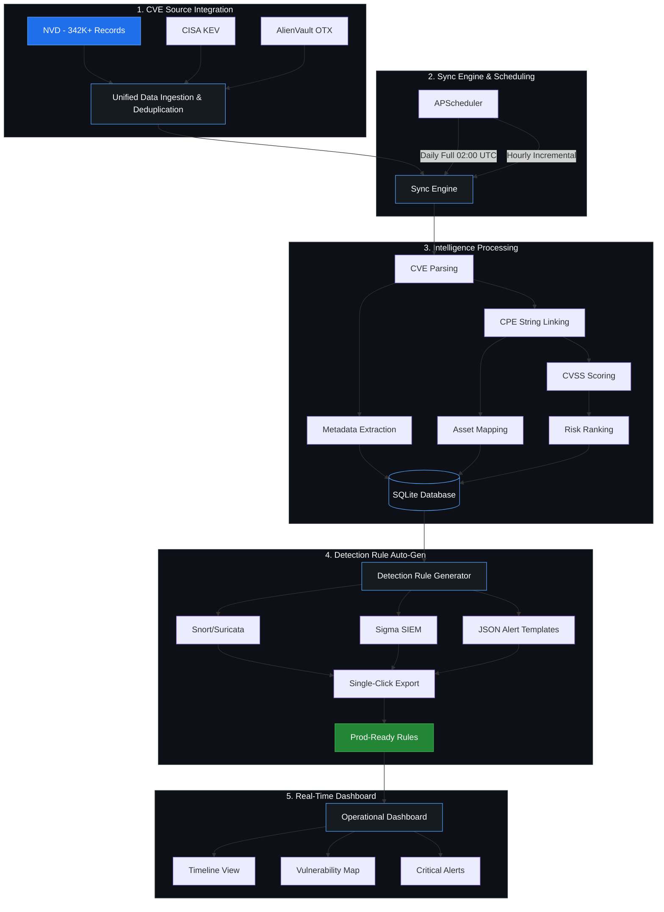
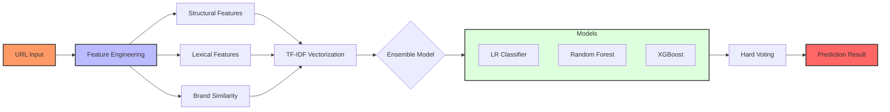

<div align="center">

[](https://git.io/typing-svg)

## *Cybersecurity Engineer | Digital Forensics Researcher | ML/AI Security Specialist*

[](https://git.io/typing-svg)

</div>


<div align="center">

[**Overview**](#-executive-overview) • [**Experience**](#-professional-experience) • [**Projects**](#-featured-projects) • [**Education**](#-education--certifications) • [**Skills**](#-technical-skills-matrix) • [**Connect**](#-connect-with-me)

</div>

<div align="center">

### **🛸 Active Intelligence Stream**
[](https://github.com/DarshakPatel2004)
[](https://github.com/DarshakPatel2004)
[](https://github.com/DarshakPatel2004)

<br/>

**📍 Pune, Maharashtra, India** | **📧 darshakpatel2004@gmail.com** | **📱 +91-9823771052**

[](https://cisco.com)
[](https://nfsu.ac.in)
[](https://cyberfirst.com)

</div>


---

## 📋 **Executive Overview**

<table>
<tr>
<td width="50%">

### 🎯 **Career Strategic Profile**
- **Education:** MSc Digital Forensics @ **NFSU Delhi** (2026)
- **Background:** BTech CSE @ **MIT ADT** (GPA: 7.39/10)
- **Certification:** Cisco CCST Cybersecurity
- **Domain:** Threat Intelligence & DFIR Automation
- **Status:** Final Year Researcher | Open for 2026 Roles

### 📊 **Operational Metrics**
- **PhishScope:** 97% Accuracy (186K+ Dataset)
- **VulnForge:** 342K+ CVE Intel Records
- **Investigations:** 10+ High-Impact Case Files
- **Platform Depth:** 5+ Operational Systems (Desktop/Mobile)

</td>
<td width="50%">

### 🛠️ **Command Center**
```
╭─────────────────────────────╮
│ Threat Intelligence         │
│ • CVE aggregation           │
│ • Automated rule gen        │
│ • Risk ranking              │
└─────────────────────────────┘
┌─────────────────────────────┐
│ Machine Learning Security   │
│ • Phishing detection        │
│ • Anomaly detection         │
└─────────────────────────────┘
┌─────────────────────────────┐
│ Digital Forensics           │
│ • Multi-OS analysis         │
│ • Evidence extraction       │
│ • Chain of custody          │
└─────────────────────────────┘
```

</td>
</tr>
</table>

---

## 💼 **Professional Experience**

### **🔍 Cyber Security Intern**
**Cyber First Private Limited | November 2024 - May 2025 | Pune, Maharashtra**

**Domain:** Digital Forensics & Cyber Incident Investigation

**Accomplishments:**
- ✅ Conducted **10+ critical forensic investigations** with comprehensive evidence analysis
- ✅ Expertise across **5+ diverse operating systems** (Windows, Linux, macOS, iOS, Android)
- ✅ Extracted & analyzed digital evidence from **10+ computers** & **10+ mobile devices**
- ✅ Applied advanced forensic techniques:
  - Memory dump analysis & RAM recovery
  - File system forensics & data carving
  - Mobile device extraction & analysis
  - Network traffic forensics
  - Malware triage & reverse engineering basics
  - Chain-of-custody documentation

**Tools & Technologies Used:**
```
┌─────────────────────────────────────────┐
│ Mobile Forensics Tools                  │
├─────────────────────────────────────────┤
│ • Cellebrite UFED → Device extraction   │
│ • Magnet Axiom → Multi-device analysis  │
│ • Oxygen Forensic Detective → Mobile    │
│ • Mobiledit Forensic Express → Analysis │
└─────────────────────────────────────────┘
┌─────────────────────────────────────────┐
│ Malware Analysis & Reverse Engineering  │
├─────────────────────────────────────────┤
│ • IDA Pro → Disassembly & debugging     │
│ • Ghidra → Binary analysis              │
│ • Burp Suite → Web vulnerability scan   │
└─────────────────────────────────────────┘
┌─────────────────────────────────────────┐
│ Network & SIEM Analysis                 │
├─────────────────────────────────────────┤
│ • Wireshark → Packet analysis           │
│ • NMap → Network reconnaissance         │
│ • Wazuh → SIEM & threat detection       │
└─────────────────────────────────────────┘
```

**Impact:**
- Directly contributed to 10+ ongoing investigation processes
- Demonstrated proficiency in multi-platform forensic analysis
- Built strong foundation for evidence handling & documentation

---

## 🚀 **Featured Projects**

### **1. VulnForge 🔥 — Automated Threat Intelligence Platform**

**Timeline:** April 2026 - Present | **Status:** Active Development

**Problem Solved:**
CVE management is fragmented across multiple sources and requires manual updates. VulnForge automates threat intelligence aggregation, correlation, and rule generation.

**System Architecture:**



<details>
<summary><b>View Classic Architectural Model</b></summary>

```
┌──────────────────────────────────────────────────────────────────┐
│                     CVE SOURCE INTEGRATION                        │
├──────────────────────────────────────────────────────────────────┤
│                                                                  │
│  NVD (342K+ Records)  ──┐                                        │
│                         ├─→ Unified Data Ingestion ──┐           │
│  CISA KEV  ─────────────┤   & Deduplication         │           │
│                         ├─→                          ├─→ ┌────┐  │
│  AlienVault OTX  ───────┘                           │   │SYNC│  │
│                                                      └──→│ENG │  │
│                                                         └────┘  │
│                                                          ↓      │
│                                  ┌──────────────────────────┐  │
│                                  │  APScheduler            │  │
│                                  ├──────────────────────────┤  │
│                                  │ Daily Full: 02:00 UTC   │  │
│                                  │ Hourly Inc: Every hour  │  │
│                                  │ (Zero manual labor)      │  │
│                                  └──────────────────────────┘  │
└──────────────────────────────────────────────────────────────────┘
                                   ↓
┌──────────────────────────────────────────────────────────────────┐
│                  INTELLIGENCE PROCESSING                          │
├──────────────────────────────────────────────────────────────────┤
│                                                                  │
│  CVE Parsing  →  CPE String Linking  →  CVSS Scoring           │
│       ↓                ↓                     ↓                   │
│  Metadata Extraction → Asset Mapping → Risk Ranking             │
│                                                                  │
│  Output: Structured CVE Intelligence in SQLite Database         │
└──────────────────────────────────────────────────────────────────┘
                                   ↓
┌──────────────────────────────────────────────────────────────────┐
│              DETECTION RULE AUTO-GENERATION                      │
├──────────────────────────────────────────────────────────────────┤
│                                                                  │
│  Format 1: Snort/Suricata Rules    →  IDS Deployment           │
│  Format 2: Sigma SIEM Rules        →  SIEM Integration         │
│  Format 3: JSON Alert Templates    →  Custom Tools              │
│                                                                  │
│  Single-Click Export → Prod-Ready Rules                         │
└──────────────────────────────────────────────────────────────────┘
                                   ↓
┌──────────────────────────────────────────────────────────────────┐
│                    REAL-TIME DASHBOARD                           │
├──────────────────────────────────────────────────────────────────┤
│                                                                  │
│ • CVE Timeline View    • Asset Vulnerability Map               │
│ • Critical Alerts      • Trend Analysis                         │
│ • Rule Generation Log  • Export History                         │
└──────────────────────────────────────────────────────────────────┘
```

</details>


**Key Features:**

| Feature | Details |
|---------|---------|
| **Data Sources** | NVD, CISA KEV, AlienVault OTX (3 integrated feeds) |
| **Database Size** | 342,000+ CVE records aggregated |
| **Update Schedule** | Daily full sync @ 02:00 UTC + Hourly incremental |
| **Asset Tracking** | CPE-to-infrastructure mapping & auto-discovery |
| **Rule Generation** | 3 formats: Snort/Suricata, Sigma, JSON |
| **Deployment** | Single-click export, production-ready |

**Tech Stack:**
```
Backend:      Python • FastAPI • SQLite
Frontend:     React 18 • Vite
Scheduling:   APScheduler (for automated syncs)
Deployment:   Docker-ready architecture
Database:     Append-only SQLite design
```

**Metrics:**
- ⚡ **Zero manual updates** (fully automated)
- 📊 **342K+ CVEs** in unified database
- 🎯 **3 output formats** for multi-tool support
- 🔄 **2 sync schedules** for data freshness

---

### **2. PhishScope 🎯 — ML-Powered Phishing Detection Engine**

**Timeline:** January 2026 - Present | **Status:** Development + Deployment

**Problem Solved:**
Phishing URLs evade traditional regex-based detection. PhishScope uses engineered features and ensemble ML to achieve 97% accuracy on real-world datasets.

**Technical Architecture:**



<details>
<summary><b>View Classic Diagnostic Architecture</b></summary>

```
PHISHING URL INPUT
       ↓
┌──────────────────────────────────────────┐
│  FEATURE ENGINEERING PIPELINE             │
├──────────────────────────────────────────┤
│                                          │
│ STRUCTURAL FEATURES (12 features):       │
│ • URL length & depth                    │
│ • Subdomain count & entropy             │
│ • Query parameter count                 │
│ • Fragment & scheme analysis            │
│ • Domain name structure                 │
│                                          │
│ LEXICAL FEATURES (8 features):          │
│ • Digit ratio & special char ratio     │
│ • Entropy & entropy variance            │
│ • Alphabetic character distribution     │
│ • Character set analysis                │
│                                          │
│ BRAND SIMILARITY (3+ features):         │
│ • Levenshtein distance scoring          │
│ • Known brand database matching         │
│ • TLD reputation scoring                │
│ • Homograph attack detection            │
│                                          │
│ Total: 20+ Engineered Features          │
└──────────────────────────────────────────┘
       ↓
┌──────────────────────────────────────────┐
│  TF-IDF VECTORIZATION                    │
├──────────────────────────────────────────┤
│ • Character n-gram analysis (2-grams)    │
│ • Term frequency weighting               │
│ • Feature normalization                  │
└──────────────────────────────────────────┘
       ↓
┌──────────────────────────────────────────┐
│  ENSEMBLE ML CLASSIFICATION               │
├──────────────────────────────────────────┤
│                                          │
│ Model 1: Logistic Regression            │
│ ├─ Probability: Phishing vs Legitimate  │
│ ├─ Confidence score                     │
│ └─ Fast inference                       │
│                                          │
│ Model 2: Random Forest (100 trees)      │
│ ├─ Feature importance ranking           │
│ ├─ Robust to outliers                   │
│ └─ Ensemble voting                      │
│                                          │
│ Model 3: XGBoost Gradient Booster       │
│ ├─ Gradient boosted decision trees      │
│ ├─ High precision tuning                │
│ └─ Best single model accuracy           │
│                                          │
│ VOTING STRATEGY:                        │
│ Hard voting (majority) for final output │
│                                          │
└──────────────────────────────────────────┘
       ↓
┌──────────────────────────────────────────┐
│  PREDICTION OUTPUT                       │
├──────────────────────────────────────────┤
│                                          │
│ Classification: Phishing OR Legitimate  │
│ Confidence Score: 0.0 - 1.0             │
│ Model Votes: (LR, RF, XGB)              │
│ Feature Importance: Top 5 features      │
│ Reasoning: Explainability               │
│                                          │
└──────────────────────────────────────────┘
```

</details>


**Performance Metrics:**

| Metric | Score |
|--------|-------|
| **Accuracy** | 97% ✓ |
| **Precision** | 0.97 (Low false positives) |
| **Recall** | 0.97 (Catches true cases) |
| **F1-Score** | 0.97 (Balanced performance) |
| **Training Data** | 186,230+ URLs |
| **Test Dataset** | Balanced phishing & legitimate URLs |

**User Interface & Deployment:**

```
┌──────────────────────────────────────────┐
│           STREAMLIT DASHBOARD            │
├──────────────────────────────────────────┤
│                                          │
│ 📋 BATCH PROCESSING:                     │
│  • Upload CSV with URLs                  │
│  • Process 100+ URLs in seconds          │
│  • Export results to JSON                │
│                                          │
│ 🔍 SINGLE URL CLASSIFICATION:            │
│  • Real-time inference                   │
│  • Confidence visualization              │
│  • Model vote breakdown                  │
│                                          │
│ 📊 SOC CONTROL SIDEBAR:                  │
│  • Statistics & metrics                  │
│  • Historical data                       │
│  • Export options                        │
│                                          │
│ 💾 JSON EXPORT:                          │
│  • Structured output format              │
│  • Integration-ready                     │
│  • Timestamped results                   │
│                                          │
└──────────────────────────────────────────┘
```

**Tech Stack:**
```
ML Frameworks:  Scikit-learn • XGBoost • TensorFlow
Data Processing: Pandas • NumPy
NLP/Text:       NLTK • TF-IDF vectorization
Frontend:       Streamlit (interactive dashboard)
Data Format:    CSV input / JSON output
```

**Key Metrics:**
- 🎯 **97% Accuracy** on 186K+ URL dataset
- 📊 **20+ Features** engineered
- ⚡ **Real-time** inference (< 100ms per URL)
- 📈 **Ensemble approach** for robustness
- 💾 **Production-ready** API & dashboard


## 🎓 **Education & Certifications**

### **👨‍🎓 MSc Digital Forensics & Information Security**
**National Forensics Science University, Delhi | Graduation: 2026**

**Specialized Coursework Completed:**
- **Unit V: Machine Learning & Deep Learning for Cybersecurity** ✅
  - Random Forest algorithms for classification
  - Isolation Forest for anomaly detection
  - LSTM networks for time-series threat detection
  - Convolutional Neural Networks (CNNs) for pattern recognition
  - Autoencoders for unsupervised learning
  - Comprehensive pseudocode documentation

**Core Competencies:**
- Network Security & Cryptography (AES, RSA, ECC)
- Digital Evidence Collection & Analysis
- SIEM Log Correlation & Threat Detection
- OWASP Top 10 Vulnerability Classes
- CVSS 3.1 Severity Scoring
- IT Act 2000 Legal Framework & Compliance
- Incident Response & Threat Hunting

---

### **🎓 Bachelor of Technology — Computer Science & Engineering**
**MIT ADT University, Pune | Graduation: 2025 | GPA: 7.39/10**

**Specialization:** Cyber Security and Forensics

**Key Subjects:**
- Penetration Testing & Vulnerability Assessment
- Cryptography & Network Security Fundamentals
- Ethical Hacking & Information Warfare
- Digital Forensics Fundamentals
- System & Network Administration
- Secure Software Development

---

### **🏆 Cisco Certified Support Technician (CCST) — Cybersecurity**
**Cisco | Certification Year: 2025** ✅

**Validates:**
- Network security fundamentals
- Threat identification & analysis
- Security tools & technologies
- Incident response basics
- Security best practices

---

## 💻 **Technical Intelligence Matrix**

> [!TIP]
> I specialize in the intersection of **Artificial Intelligence** and **Cybersecurity Operations**, focusing on automating threat detection pipelines.

<div align="center">

### **🛠 Core Engineering Stack**

| Sector | Technologies |
| :--- | :--- |
| **Languages** |     |
| **Backend** |     |
| **Forensics** | **Cellebrite UFED** • **Magnet Axiom** • **Oxygen Forensic** • **IDA Pro** • **Ghidra** |
| **ML & AI** |     |
| **AppSec** | **Burp Suite** • **Wireshark** • **NMap** • **Wazuh (SIEM)** • **OWASP Testing** |
| **Frontend** |    |

</div>

<br/>

> [!IMPORTANT]
> **Seeking Opportunities:** I am currently open to Fall 2026 internships and full-time roles in **Threat Intel**, **DFIR**, and **Security Data Science**.

---

## 📊 **GitHub Analytics & Contributions**

<div align="center">

[](https://github.com/DarshakPatel2004)

[](https://git.io/streak-stats)

[](https://github.com/DarshakPatel2004)

</div>

---

## 🏆 **Achievements & Recognition**

<div align="center">

[](https://github.com/DarshakPatel2004)

</div>

---

## 🎯 **Current Objectives (2026)**

### **💼 Career Trajectory**
- **MS in Cybersecurity:** Actively preparing for advanced studies in US/UK/EU (Fall 2026).
- **Security Research:** Seeking roles in Threat Intelligence, DFIR, or Security Automation.
- **Certifications:** Pursuing OSCP and EC-Council specialized credentials.

### **🤝 Open for Collaboration**
- Developing open-source threat intelligence modules.
- **Open Research:** Exploring automated DFIR workflows.

### **💬 Let's Discuss**
- Advanced threat detection & response
- Forensics workflow automation
- ML model selection for security
- Emerging security technologies
- Career development in cybersecurity

---

## 🌐 **Connect With Me**

<div align="center">

[](https://discord.gg/darshakpatel.)
[](https://linkedin.com/in/darshakpatel2004)
[](https://github.com/DarshakPatel2004)
[](https://x.com/Darshak48502)
[](https://reddit.com/user/LocksmithSea713)
[](https://instagram.com/diku_9603)
[](mailto:darshakpatel2004@gmail.com)

</div>

---

<div align="center">

### **Let's Build Secure Systems Together! 🚀**


**Made with ❤️ by a Cybersecurity Enthusiast**

*"Security is not a feature. It's a foundation for trust."*

**April 2026 | Driven by Curiosity & Innovation**

</div>
